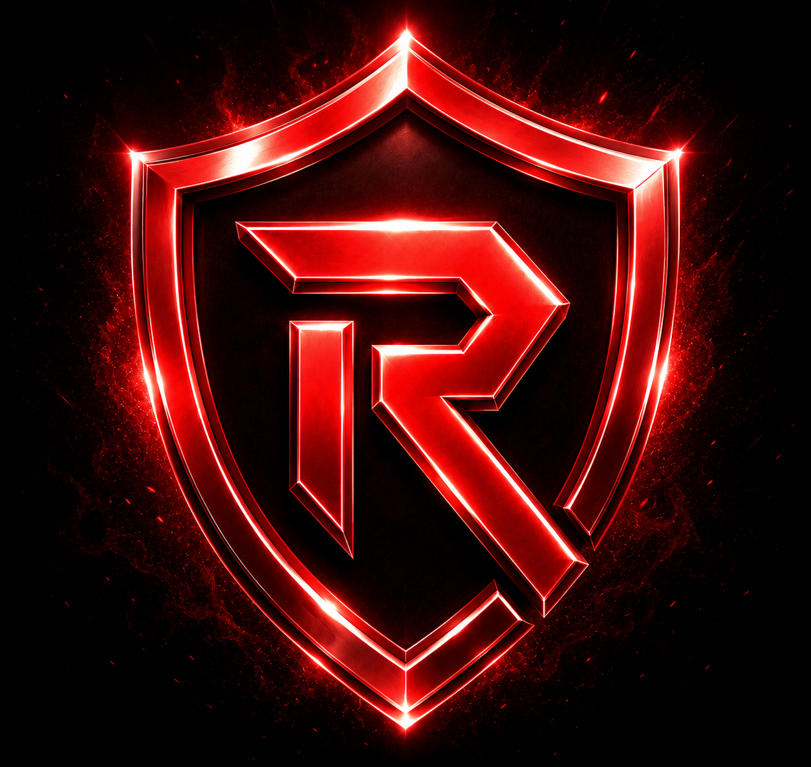

  

<h1 align="center">RAKSHAK</h1>

  <strong>Advanced Discord Security, Anti-Nuke, Moderation & Utility Bot</strong>

  
  
  
  

  

---

## Overview

Rakshak is a Discord security bot built for communities that need fast protection, reliable moderation, and clear server control.

It helps server owners and administrators protect their servers from raids, nukes, dangerous permission changes, webhook abuse, suspicious role updates, spam, and other harmful activity.

Rakshak focuses on practical server safety: detect threats quickly, respond with configured actions, log important events, and give staff the tools they need to manage their community responsibly.

---

## Core Features

### Anti-Nuke Protection

Detects suspicious server actions such as mass channel changes, role updates, webhook abuse, bot additions, permission escalation, and other dangerous activity.

### Moderation Tools

Includes essential moderation tools for handling bans, kicks, timeouts, warnings, message cleanup, and staff-controlled server actions.

### AutoMod & Spam Protection

Helps reduce spam, invite abuse, mass mentions, unsafe content patterns, and unwanted message behavior based on server configuration.

### Server Logging

Provides logs for important server events, including moderation actions, member activity, channel updates, role changes, and security incidents.

### Ticket System

Allows servers to manage support requests, reports, appeals, and staff communication through organized ticket channels.

### Utility Features

Includes useful server tools, configuration panels, command systems, and quality-of-life features for community management.

---

## Privacy & Responsible Data Use

Rakshak is designed around the principle of least privilege.

The bot only uses Discord data, permissions, and gateway intents that are required for enabled features such as security, moderation, logging, automod, member events, and command handling.

Rakshak does not sell user data, does not use message content for advertising, and does not use collected data for unrelated profiling.

Server-specific logs and settings are intended to be visible only to users with appropriate Discord permissions, such as server owners, administrators, or authorized moderators.

---

## Official Links

| Purpose | Link |
|---|---|
| Add Rakshak | [Invite Bot](https://discord.com/oauth2/authorize?client_id=1468344209051357187&permissions=8&scope=bot%20applications.commands) |
| Support Server | [Join Support](https://discord.gg/EwhewfZNbT) |
| Privacy Policy | [View Policy](https://RakshakBot.github.io/Rakshak/privacy-policy/) |
| Terms of Service | [View Terms](https://RakshakBot.github.io/Rakshak/terms-of-service/) |
| Data Deletion | [Deletion Requests](https://RakshakBot.github.io/Rakshak/data-deletion/) |
| Security | [Security Information](https://RakshakBot.github.io/Rakshak/security/) |

---

## Legal Documents

This repository contains Rakshak’s public legal and security documents:

- [Privacy Policy](./privacy-policy.md)
- [Terms of Service](./terms-of-service.md)
- [Data Deletion](./data-deletion.md)
- [Security](./security.md)

These documents explain how Rakshak handles data, how users can request deletion, and how the bot uses Discord permissions and privileged intents responsibly.

---

## Security Notice

Rakshak will never ask for your Discord password, token, payment card details, or private credentials.

Only invite Rakshak from official links. Always review requested permissions before adding any bot to your server.

If you discover a security issue, report it privately through the support server or by email.

---

## Contact

| Purpose | Contact |
|---|---|
| Support Server | https://discord.gg/EwhewfZNbT |
| Email | rakshakbot@gmail.com |

---

  © 2026 Rakshak. All rights reserved.

