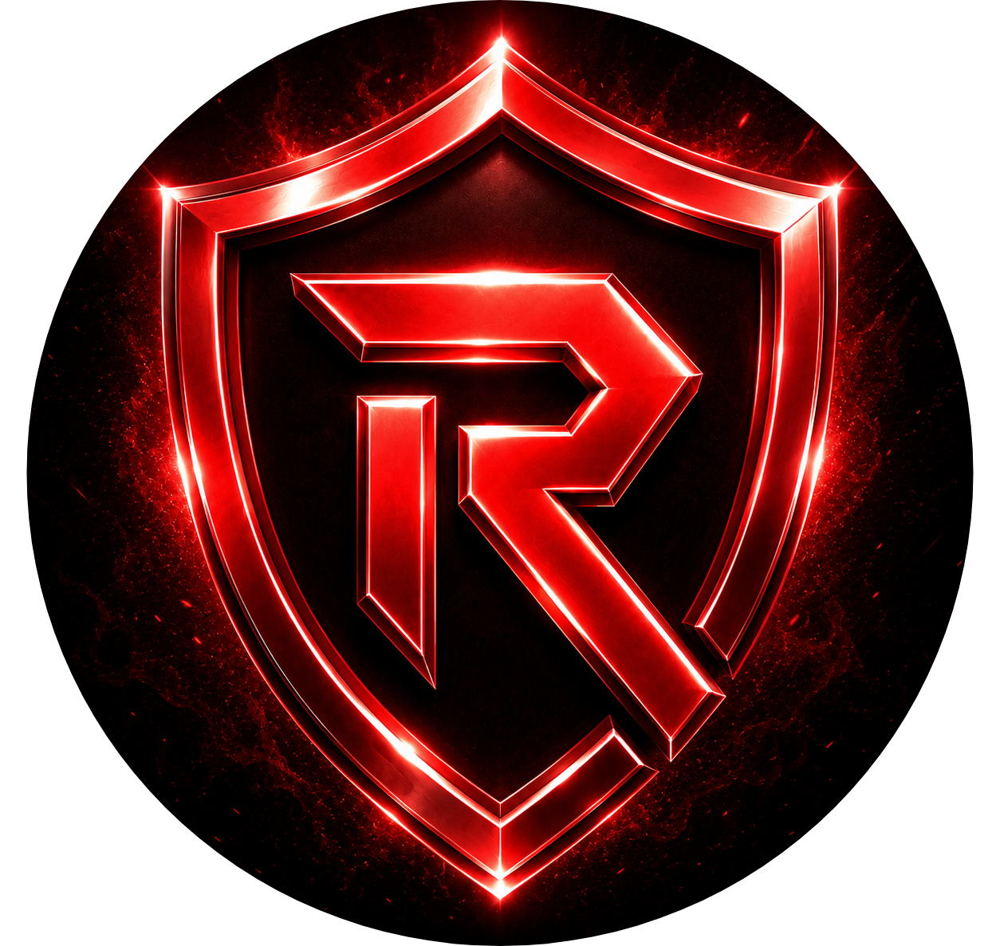
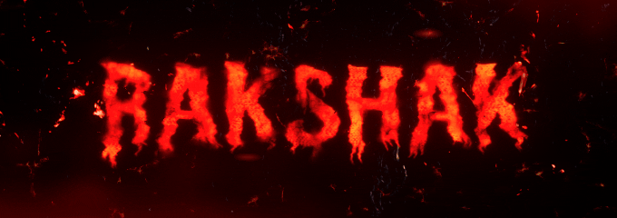

  

<h1 align="center">RAKSHAK</h1>

  <strong>Advanced Discord Security, Anti-Nuke, Moderation & Utility Bot</strong>

  
  
  
  
  

  

## Overview

Rakshak is a Discord security, anti-nuke, moderation, automod, logging, ticket, voice/J2C, utility, premium, AI, music, and server management bot built to help server owners protect and manage their communities.

Website: [https://RakshakBot.github.io/Rakshak/](https://RakshakBot.github.io/Rakshak/)

## What Rakshak Does

| Area | Summary |
| --- | --- |
| Protects Servers | Helps monitor risky actions, raids, permission changes, webhooks, and destructive behavior. |
| Moderates Communities | Supports staff with bans, kicks, timeouts, warnings, locks, cleanup, and role workflows. |
| Automates Safety | Helps filter spam, invites, links, mass mentions, caps abuse, emoji spam, and blocked words. |
| Logs Important Events | Tracks moderation, security, messages, members, voice, channel, role, and server events. |
| Manages Tickets & Voice | Supports ticket workflows and join-to-create private voice channel controls. |
| Unlocks Premium Tools | Adds advanced security controls, AI features, music, TTS, branding, and configuration. |

## Feature Categories

| Category | Examples |
| --- | --- |
| Security & Anti-Nuke | Anti-nuke, anti-raid, dangerous permission protection, bot-add protection, webhook monitoring, incident logs. |
| Moderation | Ban, kick, timeout, mute, warn, jail-style moderation, role management, lock/unlock, purge. |
| AutoMod | Spam, caps, links, invites, mass mentions, emoji spam, blocked words, configurable punishments. |
| Logging | Message edits/deletes, joins/leaves, member updates, voice logs, channel/role/server events. |
| Tickets | Panels, categories, claim, lock/unlock, close/reopen, transcripts, ticket logs. |
| Voice / J2C | Private voice channels, owner controls, lock/unlock, hide/unhide, claim, permit, ban. |
| Utility | Server/user info, welcome, Join DM, autorole, invite tracking, leveling, reaction roles, verification, reminders, translation. |
| Premium / AI / Music | Premium access, premium security, AI features, 24/7 music, TTS, custom branding, vanity guard. |

## Responsible Data Use

Rakshak follows least privilege and only uses Discord data, permissions, and gateway intents required for enabled features.

Message content is processed only for enabled features that require it, such as prefix commands, automod, spam protection, moderation filters, AI/chatbot channels, autoresponders, and security detection. Member data may support moderation, autorole, welcome flows, logs, invite tracking, and role/member protection. Presence or activity data may be used only for enabled status-related features.

Rakshak does not sell user data and does not use message content for advertising or profiling.

## Official Links

| Purpose | Link |
| --- | --- |
| Website | https://RakshakBot.github.io/Rakshak/ |
| Invite Rakshak | https://discord.com/oauth2/authorize?client_id=1468344209051357187&permissions=4513499492773111&integration_type=0&scope=bot%20applications.commands |
| Vote on Top.gg | https://top.gg/bot/1468344209051357187/vote |
| Support Server | https://discord.gg/EwhewfZNbT |
| Privacy Policy | https://RakshakBot.github.io/Rakshak/privacy-policy/ |
| Terms of Service | https://RakshakBot.github.io/Rakshak/terms-of-service/ |
| Data Deletion | https://RakshakBot.github.io/Rakshak/data-deletion/ |
| Security | https://RakshakBot.github.io/Rakshak/security/ |
| Copyright | https://RakshakBot.github.io/Rakshak/copyright/ |
| Contact | https://RakshakBot.github.io/Rakshak/contact/ |
| Mail | https://RakshakBot.github.io/Rakshak/mail/ |
| Official Links | https://RakshakBot.github.io/Rakshak/official/ |

## Legal & Policies

| Document | Repository File | Website Page |
| --- | --- | --- |
| Privacy Policy | [Privacy.md](./Privacy.md) | https://RakshakBot.github.io/Rakshak/privacy-policy/ |
| Terms of Service | [Terms.md](./Terms.md) | https://RakshakBot.github.io/Rakshak/terms-of-service/ |
| Data Deletion | [Data-Deletion.md](./Data-Deletion.md) | https://RakshakBot.github.io/Rakshak/data-deletion/ |
| Security Policy | [Security.md](./Security.md) | https://RakshakBot.github.io/Rakshak/security/ |
| Copyright / Brand Protection | [Copyright.md](./Copyright.md) | https://RakshakBot.github.io/Rakshak/copyright/ |
| Contact | [Contact.md](./Contact.md) | https://RakshakBot.github.io/Rakshak/contact/ |
| Mail | [Mail.md](./Mail.md) | https://RakshakBot.github.io/Rakshak/mail/ |
| Official Links | [Official.md](./Official.md) | https://RakshakBot.github.io/Rakshak/official/ |

## Contact

| Purpose | Contact |
| --- | --- |
| Support Server | https://discord.gg/EwhewfZNbT |
| Email | rakshakbot@gmail.com |

## Security Notice

Rakshak will never ask for Discord passwords, Discord tokens, payment card details, API keys, database credentials, or private credentials.

Only invite Rakshak from official links and review requested permissions before adding any bot to your server.
